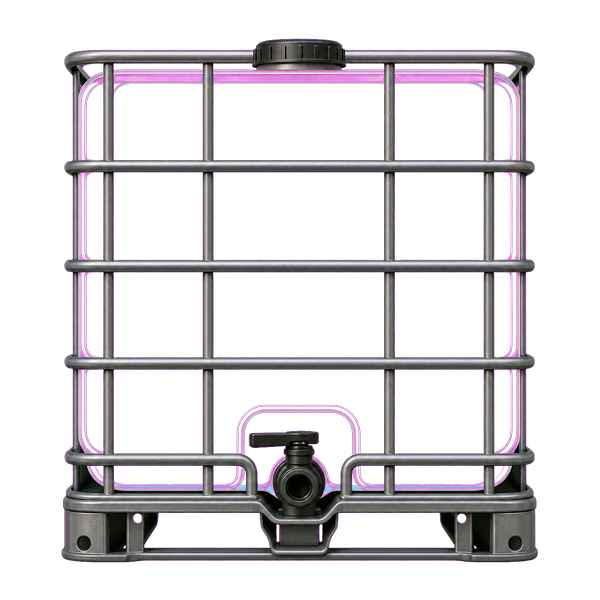
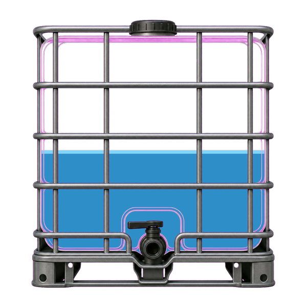
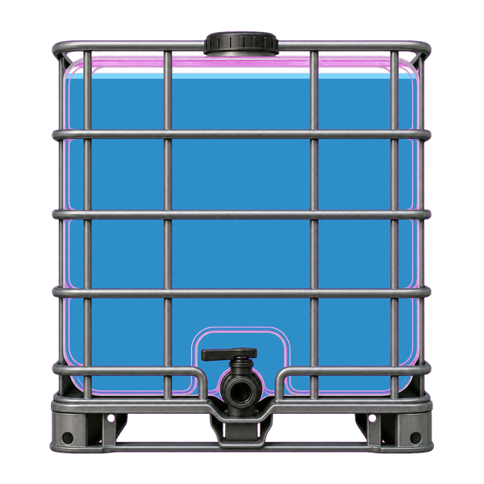

# IBC-tankmätare med ESPHome

Det här projektet mäter vätskenivån i ett system med fyra sammankopplade
IBC-tankar med hjälp av en ESP32 och en ultraljudssensor. Avståndet från
sensorn till den gemensamma vätskeytan räknas om till:

- avstånd i meter
- fyllnadsnivå i procent
- uppskattad volym i liter

Enheten ansluter till Home Assistant via ESPHome API och har även en lokal
webbsida på port 80.

Avståndet provtas var 10:e sekund och medianfiltreras över tre mätningar.
Avstånd, nivå och volym publiceras normalt var 30:e sekund; det första
värdet skickas direkt efter uppstart.

## Anpassat för fyra sammankopplade IBC-tankar

Projektet är skapat för fyra IBC-tankar à cirka 1 000 liter som är
sammankopplade i serie, med en total kapacitet på cirka 4 000 liter.
Konfigurationens standardvärde `capacity_l: "4000"` och volymberäkning är
anpassade för denna installation.

Beräkningen förutsätter att tankarna är hydrauliskt sammankopplade så att
vätskan kan flöda mellan dem och nivån blir densamma i samtliga tankar. En
sensor i en av tankarna används då för att uppskatta den sammanlagda volymen
i alla fyra.

Om antalet tankar, tankarnas storlek eller hur de är sammankopplade skiljer
sig måste `capacity_l` och eventuellt beräkningsmodellen anpassas.

## Förutsättningar

- ESP32 (`esp32dev`)
- ultraljudssensor med pulsbreddsbaserad utsignal
- ESPHome
- Wi-Fi
- Home Assistant är valfritt, men rekommenderas

Kontrollera sensorns matningsspänning och signalnivå innan den ansluts till
ESP32. ESP32:s GPIO-pinnar tål 3,3 V.

## Filer

- `ibc-tank-1.yaml` – ESPHome-konfigurationen
- `home-assistant/ibc-tank-card.yaml` – Lovelace-kort med levande vattennivå
- `home-assistant/ibc-tank-overlay.png` – transparent tankbild till kortet
- `secrets.yaml` – egna lösenord och nycklar; ska skapas lokalt och får inte
  läggas in i Git

## Anpassa konfigurationen

Överst i `ibc-tank-1.yaml` finns projektets viktigaste inställningar:

```yaml
substitutions:
  device_name: ibc-tank-1
  friendly_name: IBC Tank 1
  trigger_pin: GPIO19
  echo_pin: GPIO18
  distance_offset_m: "0.020"
  empty_distance_m: "1.00"
  full_distance_m: "0.15"
  capacity_l: "4000"
```

Ändra följande värden:

- `device_name` – enhetens tekniska namn i ESPHome. Använd små bokstäver,
  siffror och bindestreck.
- `friendly_name` – namnet som visas i ESPHome och Home Assistant.
- `echo_pin` – är förberedd som substitution men används inte i den nuvarande
  konfigurationen.
- `distance_offset_m` – fast avståndskorrigering i meter. Positivt värde läggs
  till sensorvärdet; `"0.020"` korrigerar 59,8 cm till 61,8 cm.
- `empty_distance_m` – uppmätt avstånd i meter från sensorn till vätskeytan
  när tanken är tom.
- `full_distance_m` – uppmätt avstånd i meter när tanken är full.
- `capacity_l` – tankens användbara volym i liter.

Den GPIO som faktiskt används anges som `pin: GPIO18` under sensorn
`ibc_distance`. Ändra den raden om sensorn är ansluten till en annan pinne.
Även `trigger_pin` är förberedd som substitution men används inte av den
nuvarande `pulse_width`-sensorn. Den behöver därför inte ändras om inte
konfigurationen byggs om för en sensor med separat trigger.

Kalibrera först `distance_offset_m` mot ett känt avstånd. Beräkna offseten som
`verkligt avstånd - uppmätt avstånd`, uttryckt i meter. Exempel: `0.618 - 0.598 = 0.020`, vilket ger `distance_offset_m: "0.020"`.

Mät `empty_distance_m` och `full_distance_m` i den verkliga installationen.
Det är dessa två värden som avgör hur avståndet räknas om till procent och
liter.

## Skapa `secrets.yaml`

Skapa filen `/config/secrets.yaml` i ESPHome-katalogen om den inte redan
finns:

```yaml
wifi_ssid: "DITT_WIFI_NAMN"
wifi_password: "DITT_WIFI_LOSENORD"
ibc_tank_1_api_key: "DIN_32_BYTE_BASE64_NYCKEL"
ibc_tank_1_ota_password: "ETT_STARKT_OTA_LOSENORD"
ibc_tank_1_fallback_password: "ETT_STARKT_RESERVNATS_LOSENORD"
```

Skapa en API-nyckel med:

```bash
openssl rand -base64 32
```

Den riktiga `secrets.yaml` ignoreras av Git och ska aldrig pushas till
GitHub.

## Validera och installera

Validera först konfigurationen:

```bash
esphome config ibc-tank-1.yaml
```

Kompilera och installera därefter:

```bash
esphome run ibc-tank-1.yaml
```

Första installationen kan göras via USB. Efter det kan uppdateringar normalt
skickas trådlöst med ESPHome OTA.

## Kalibrering

1. Montera sensorn så att den pekar rakt ned och inte träffar tankens väggar
   eller stag.
2. Mät avståndet till vätskeytan när tanken är så tom som möjligt och ange
   värdet som `empty_distance_m`.
3. Mät avståndet vid önskad maxnivå och ange värdet som `full_distance_m`.
4. Ange tankens verkliga användbara volym som `capacity_l`.
5. Jämför det beräknade värdet med en känd mängd vätska och finjustera
   avstånden vid behov.

Beräkningen antar att volymen förändras linjärt med vätskenivån, vilket
passar en IBC-tank med i stort sett jämnt tvärsnitt.

## Home Assistant-kort

I `home-assistant/` finns ett färdigt Lovelace-kort som visar:

- en IBC-tank med levande vattennivå
- fyllnadsgrad i procent
- avrundad volym i hela liter
- en mjuk övergång när sensorn rapporterar en ny nivå

| Tom | 50 % | 100 % |
|:---:|:---:|:---:|
|  |  |  |

Kortet använder [Button Card](https://github.com/custom-cards/button-card), som kan
installeras via HACS.

### Installera bilden

Kopiera `home-assistant/ibc-tank-overlay.png` till Home Assistants
`/config/www/images/ibc-tank-overlay.png`. Filen blir då tillgänglig i Lovelace
som `/local/images/ibc-tank-overlay.png`.

### Lägg till kortet

Kopiera innehållet i `home-assistant/ibc-tank-card.yaml` till ett manuellt kort
i dashboarden. I en YAML-baserad dashboard kan samma block klistras in under
`cards:`.

Standardkonfigurationen använder entiteterna:

```text
sensor.ibc_tank_1_niva
sensor.ibc_tank_1_volym
```

Kontrollera entitetsnamnen under **Inställningar → Enheter och tjänster →
Entiteter** i Home Assistant. Om ESPHome-enheten har fått ett annat namn,
ersätt båda entitets-ID:n i kortfilen.

Vattenlagrets höjd följer nivåsensorn kontinuerligt mellan 0 och 100 procent.
Tankbilden ligger ovanpå vattenlagret, vilket gör att nivån syns genom gallret
utan att bilden behöver genereras om.
